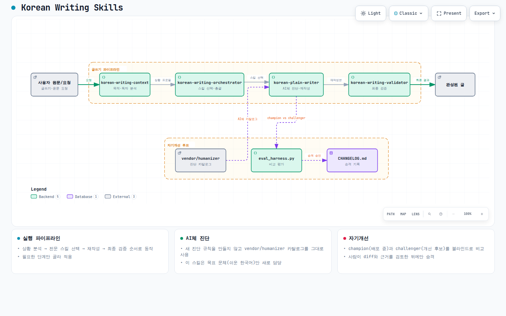

# Korean writing skills

글의 목적·독자·매체·위험도에 맞춰 필요한 단계를 고르고, 한국어 글을 쓰거나 고치는
Claude Code 스킬 모음입니다. 모든 규칙을 무조건 적용하지 않고 큰 구조에서 작은 표현
순서로 고친 뒤 의미와 목적 적합성을 검증합니다.

## 전체 구조

## 스킬 구성

- `korean-writing-orchestrator`: 전체 작업 순서와 전문 스킬 선택
- `korean-writing-context`: 목적·독자·매체·격식·위험도 분석
- `korean-plain-writer`: 쉬운 한국어, 장르별 구조·톤, AI체 개선
- `korean-writing-validator`: 사실·의미 보존과 목적 적합성 최종 검증

기본 진입점은 [`korean-writing-orchestrator/SKILL.md`](./skills/korean-writing-orchestrator/SKILL.md)입니다.

각 스킬은 [`skills/`](./skills/)에 있습니다. `skills/<이름>/SKILL.md` 하위에 스킬 하나를 통째로 담는 구조는
DaleSeo/korean-skills와 DietrichGebert/ponytail 등 여러 Claude Code 스킬 레포가
공통으로 쓰는 방식을 따른 것입니다. `.claude-plugin/`은 이 레포를 Claude Code
플러그인/마켓플레이스로 바로 설치할 수 있게 하는 최소 매니페스트입니다.

- 쉬운 한국어 전문 스킬: [`skills/korean-plain-writer/SKILL.md`](./skills/korean-plain-writer/SKILL.md)
- 진단 카탈로그: [`references/ai-tell-catalog.md`](./skills/korean-plain-writer/references/ai-tell-catalog.md) (요약),
  [`vendor/humanizer/`](./skills/korean-plain-writer/vendor/humanizer/) (전문, [DaleSeo/korean-skills](https://github.com/DaleSeo/korean-skills)의 humanizer를 그대로 복사)
- 목표 문체 모듈:
  - [`references/plain-vocabulary-map.md`](./skills/korean-plain-writer/references/plain-vocabulary-map.md): 어휘 순화 매핑표
  - [`references/structure-patterns.md`](./skills/korean-plain-writer/references/structure-patterns.md): 정보 전달 글 구조 템플릿
  - [`references/genre-rules.md`](./skills/korean-plain-writer/references/genre-rules.md): 장르별 톤 규칙
  - [`references/fabricated-terms.md`](./skills/korean-plain-writer/references/fabricated-terms.md): 조어형 추상 개념어 판별법
- 예문 뱅크: [`examples/pairs/`](./skills/korean-plain-writer/examples/pairs/) (Before/After, 100~200쌍이 목표이고 지금은 45쌍)
- 변경률 확인 스크립트: [`scripts/change_rate_check.py`](./skills/korean-plain-writer/scripts/change_rate_check.py)
- 평가 하네스: [`eval/HARNESS.md`](./skills/korean-plain-writer/eval/HARNESS.md) 및
  [`scripts/eval_harness.py`](./skills/korean-plain-writer/scripts/eval_harness.py)
- 참조 무결성 검사: [`scripts/check_references.py`](./scripts/check_references.py) (레포 루트, 스킬 파일들이 서로 가리키는 경로가 실제로 존재하는지 확인)
- 평가: [`eval/`](./skills/korean-plain-writer/eval/) (예문 뱅크와 겹치지 않는 held-out
  텍스트로 블라인드 A/B + 의미 보존 게이트를 따로 채점. `eval/change-rate-baseline.md`는
  변경률 임계값을 재조정한 실측 근거)
- 릴리즈 노트: [`CHANGELOG.md`](./skills/korean-plain-writer/CHANGELOG.md) (승격할 때마다
  뭐가·왜 바뀌었는지, 어떤 근거로 검증했는지 기록)
- 작문 품질(구조·논리·설득력) 평가: [`korean-writing-orchestrator/eval/`](./skills/korean-writing-orchestrator/eval/)
  (새 글쓰기 전용, 하네스는 `korean-plain-writer/scripts/eval_harness.py`를 공유.
  첫 파일럿 실행 완료, validation 세트는 아직 없음)

## 설계 원칙

1. 바퀴를 다시 만들지 않습니다. AI체 진단은 검증된 외부 카탈로그를 그대로 씁니다.
2. 직접 만들 가치가 있는 부분("그럼 어떻게 써야 하는가")에만 집중합니다.
3. 목적·독자·매체·위험도를 장르보다 먼저 판단하고 필요한 전문 스킬만 적용합니다.
4. 구조와 표현을 분리합니다. 수능 비문학은 논리 구조 학습용으로만 쓰고, 문장 표현의
   모범으로는 쓰지 않습니다.
5. 의미 보존이 최우선입니다. 사실관계·수치·주장 방향은 절대 바꾸지 않습니다.
6. 이미 자연스러운 글과 글쓴이의 목소리를 불필요하게 평준화하지 않습니다.
7. 성능은 원문·단순 프롬프트·현재 버전·후보 버전의 블라인드 비교와 의미 보존 게이트로
   검증합니다. 개선 AI가 평가 정책이나 비공개 테스트를 바꿀 수 없게 합니다.
8. 사람에게 요구하는 건 증거 기준 통과·근거 실재·위험 감수 여부뿐입니다. 하네스가
   확신하는 승격은 사람 승인 없이 진행하고, 확신하지 못하는 승격은 사람이 결정합니다
   (`korean-plain-writer/eval/product-contract.md`의 "사람의 역할" 절 참고).

전체 파이프라인(상황 분석 → 우선순위 결정 → 전문 스킬 선택 → 순차 수정 → 최종 검증)은
[`korean-writing-orchestrator/SKILL.md`](./skills/korean-writing-orchestrator/SKILL.md)를 참고하세요.

## 현재 상태 / 다음 단계

**완료**

- 4개 스킬 파이프라인, `.claude-plugin/` 매니페스트
- `korean-plain-writer`: references 5종, 예문 뱅크 45쌍, `vendor/humanizer/` 로컬 복사,
  변경률·참조 무결성 스크립트
- 평가 하네스(`eval_harness.py`): champion/naive/challenger 블라인드 비교, 결정론적
  문법·AI체 패턴 검사, 독립 채점자 재검증 절차
- 개선 라운드 3회 실행, `korean-plain-writer` v0.2.0 → v0.2.2 (근거는
  [`eval/results.md`](./skills/korean-plain-writer/eval/results.md)와
  [`CHANGELOG.md`](./skills/korean-plain-writer/CHANGELOG.md))
- `korean-writing-orchestrator`에 작문 품질(구조·논리·설득력) 평가 인프라 신설,
  첫 파일럿 실행
- 국립국어원 『쉬운 공문서 쓰기 길잡이』 1~3장·3부 반영 (`genre-rules.md`,
  `plain-vocabulary-map.md`)
- 평가·글쓰기 기준 근거 자료 조사 (`eval/related-work.md`), 유창성 체크 축 추가
- 자기개선 시스템 재설계: 실패 로그 누적, held-in(dev)/held-out(validation)
  이중 비퇴화 승격 규칙, 사람을 주 채점자로 두는 절차 (설계 배경은
  [`eval/self-improvement-prd.md`](./skills/korean-plain-writer/eval/self-improvement-prd.md),
  실행 절차는 `human-rating-protocol.md`·`failure-log.jsonl`)

**다음 단계**

- 새 구조로 첫 라운드 실제 진행(사람이 직접 글을 쓰고 채점)
- `failure-log.jsonl`의 열린 항목("것이다" 정적 탐지 패턴 부재, 확신의 강도
  보존 체크 부재) 처리
- 다른 회사 LLM 채점자 확보, 사람 채점자 2명 이상으로 확대
- 저장소 밖 비공개 테스트셋 구축
- 외부 맞춤법 검사기 연동(네트워크 제약으로 보류)
- 문장 길이 등 자체 가독성 지표 추가
